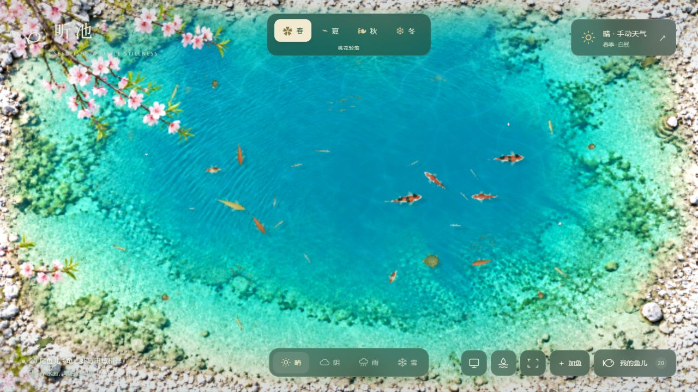

# 听池 · 交互桌面壁纸

在 Windows 桌面上放一片会随四季和天气变化的小湖。鱼儿自行游动，偶尔投食、拨水，随时离开也没有损失。

**当前为 `v0.1.0-beta.1` 预览版。已完成独立网页包和浏览器检查；实际 Windows 桌面宿主的输入、暂停、多屏和重启存档仍待实测。**

**[下载 Lively 壁纸包](https://github.com/wushiguize/seedfish-pond/releases/download/v0.1.0-beta.1/seedfish-pond-v0.1.0-beta.1-lively.zip)** · [查看发布说明与全部附件](https://github.com/wushiguize/seedfish-pond/releases/tag/v0.1.0-beta.1)

请下载上面的 `*-lively.zip`。GitHub 的 **Code → Download ZIP** 和 Release 自动生成的 **Source code** 是仓库文件，不是可导入的壁纸包。

## 装到桌面

1. 从 [Lively 官方网站](https://www.rocksdanister.com/lively/) 安装免费的 Lively Wallpaper。
2. 在 Lively「设置 → 壁纸 → 网页浏览器」选择 **WebView2**，开启 **磁盘缓存 / Disk cache**。
3. 将下载的 `seedfish-pond-v0.1.0-beta.1-lively.zip` 直接拖入 Lively，导入后在库中选中并应用。
4. 在「设置 → 壁纸 → 交互 → 壁纸输入」选择 **鼠标 / Mouse**。点击桌面空白处后，就可以投食、拨水和选择鱼儿。

普通使用无需安装 Node.js，也无需启动本地网页服务。改名、城市搜索和粘贴存档时，临时切换 **键盘 / Keyboard** 输入，完成后切回 Mouse。[完整使用说明与存档方法](GETTING_STARTED.md)

## 可以做什么

- 新池塘默认 **20 条鱼、8 个品种 / 品系**；鱼库提供 **56 个品种 / 品系**，可添加、命名、选择游动性格和暂养。
- 点击水面投食，切换拨水后轻点或拖动起波，浮叶也会被水流推动。
- 主界面切换春夏秋冬；桃花、柳枝、枫叶、霜枝与季节生态随之变化。
- 晴天清澈透光，阴天柔和散射；雨雪落水会产生波纹。天气与昼夜光照可分别设置。
- 除鱼儿和乌龟，还有虾、螺、青蛙和夏日蜻蜓。没有每日任务、饥饿扣减或离线损失。

鱼类选项包含同一物种的不同品系，不等于 56 个独立物种；模型采用照片参考与程序建模，尚未采用实物扫描。这里是虚拟观赏场景，不作为真实鱼类混养建议。

## 存档与联网

每位使用者从自己的新池塘开始，下载包不包含作者的养鱼记录。自动保存位于本机；Lively 的预览窗口和真正的桌面实例使用不同存储，在实际桌面中完成长期设置。首次配置后请导出一份 JSON 备份，并退出重开，核对鱼名、数量和进食记录。

手动天气可离线使用。城市搜索和实时天气联动需要联网，使用 [Open-Meteo](https://open-meteo.com/en/pricing) 的接口；当前联动按个人非商业使用的原型配置。鱼名和养鱼记录不上传到 GitHub。

## 发布范围与反馈

本仓库提供使用说明和预览图，编译后的壁纸包放在 Release 附件中；本次未公开完整开发源码，也未为原创部分授予开源许可证。第三方组件声明见 [THIRD_PARTY_NOTICES.txt](THIRD_PARTY_NOTICES.txt)。

遇到问题可在 [Issues](https://github.com/wushiguize/seedfish-pond/issues) 提交 Windows / Lively 版本、操作步骤与截图。分享时优先发送上面的发布页，方便接收者下载正确的包。
